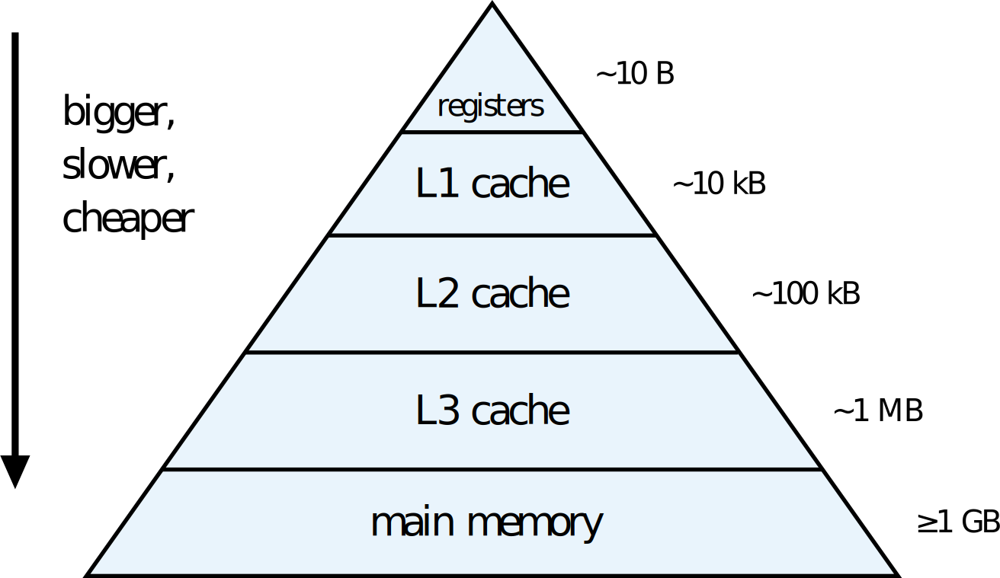

# Exercise: Cache Bandwidths

In this exercise you will benchmark a **Schoenauer triad** kernel (i.e. `a[i] = b[i] + c[i] * d[i]`) and see how the observed performance is effected by the memory hierarchy, i.e. different cache levels (see image below).

<br>

**Memory hierarchy**



<br>

**Hint:** On most systems, you can programmatically query the cache sizes via

```julia
using CpuId
cachesize()
```

**Note: Ideally, this exercise should be done on a cluster compute node. You can either follow the instructions below or use the Jupyter notebook `cache_bandwidths.ipynb`.**

## Tasks

1) Inspect the file `cache_bandwidths.jl` and implement the missing piece (look for the TODO annotation).
2) Run the benchmark as a job via `sbatch job_script.sh`.
  * Do you understand the trend of the resulting plot (`sdaxpy_contiguous.svg`)?
  * Which maximal bandwidth values (in GB/s) do you obtain for L1, L2, L3, and main memory? (Check the output file.)

    |  measurements   |  bandwidth [GB/s] |
    |:---------------:|:-----------------:|
    |  L1D cache      |  TODO             |
    |  L2  cache      |  TODO             |
    |  L3  cache      |  TODO             |
    |  main memory    |  TODO             |

Let's investigate the performance impact of strided data access vs contiguous data access (as benchmarked above).

3) Create a copy of `cache_bandwidths.jl` and name it `cache_bandwidths_strided.jl`. Modify the `sdaxpy!` function such that it only performs the SDAXPY computation to every other vector element (i.e. instead of `1:n` you iterate over `1:2:n`). This corresponds to a stride size of 2.
4) Since we now only perform half as many operations and thus only half of the data transfer, we need to account for this change in all bandwidth computations. Specifically, check all lines that contain `32.0e-09` and insert an extra factor of 0.5.
5) Run the benchmark for the strided SDAXPY (uncomment the respective line in `job_script.sh` and submit the job script again). How do the results compare to the contiguous case? What's the reason?
