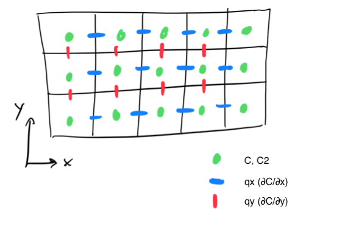
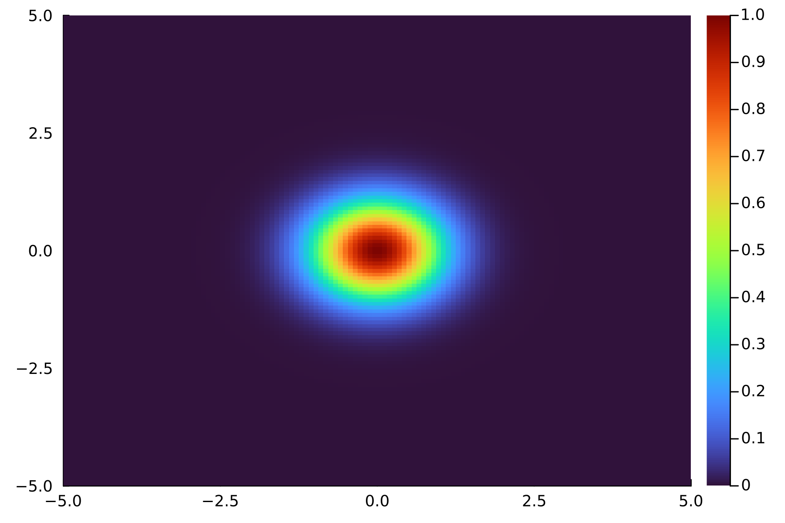

# Exercise: 2D Diffusion - Multithreading

**Note:** We will come back to this example in the GPU and MPI part of the course. It is thus worth to briefly introduce the physics, the considered performance metrics, and the general code structure, before turning to the actual exercise tasks.

## Brief Physics Introduction

### The equation

We will solve the 2D diffusion equation for a quantity $C$,

$\dfrac{\partial C(x,y,t)}{\partial t} = D ~ \Delta C(x,y,t)~.$

Here, $D$ stands for the diffusion coefficient and $Δ$ is the Laplace operator and indicates second order spatial derivatives. The field $C(x,y,t)$ could, for example, be the distribution of heat on a surface (2D) at a particular point in time.

Often times the diffusion equation is written in terms of *diffusive fluxes* as two coupled equations:

$\dfrac{∂C}{∂t} = -∇ ⋅ q~,$

where $q$ represents the diffusive flux:

$q = -D ~ ∇C~.$

### Solving the equation
We will solve this partial differential equation (PDE) using the **finite-difference method** and explicit forward **Euler integration** on a regular Cartesian grid (we'll consider the quadratic case most of the time).

As a reminder, finite-difference means using

$f'(x) = \dfrac{f(x+ds) - f(x)}{ds}$

to approximate (first order) spatial derivatives. Euler integration means discretizing time and using

$f_{t+1} = f_{t} + dt⋅f'(t)$

to propagate $f$ in time.

### Parameters and initial condition
The 2D domain is of size $L=10$ and the scalar linear diffusion coefficient $D=1$. We use a constant grid size `ds = L / ns`, where `ns` represent the number of finite-difference cells in both $x$ and $y$ dimension.

As initial condition, we define a Gaussian perturbation centred in the middle of the domain of amplitude and standard deviation equal to 1.

This Gaussian will diffuse over time (think of heat spreading out over a surface).

## Performance Metrics

### Wall time

The first performance metric is wall time, or total runtime. We compute it using a simple tic-toc approach, making sure to skip the first 10 iterations to account for "warm-up".

### Effective memory throughput (`T_eff`)

The second metric is the effective memory throughput $T_\mathrm{eff}$ (`T_eff` in the REPL). It defines as the **non-redundant** memory access per iteration divided by the time per iteration $t_\mathrm{it}$ (in sec.):

$T_\mathrm{eff} = \dfrac{A_\mathrm{eff}}{t_\mathrm{it}}~,$

where $A_\mathrm{eff} = n_\mathrm{IO} ~ n_s^2 ~ s_\mathrm{DAT} ~ 10^{-9}$ is the effective memory access (in GB).

In our example, $n_\mathrm{IO} = 2$ as we only need to read old values of $C$ and write them back to solve the diffusion PDE. $s_\mathrm{DAT} = 8$ as we are running double precision floating point arithmetic.

$T_\mathrm{eff}$ provides an idea on how far from the performance of memory copy only memory-bounded codes are, under various assumptions. Refer to [Räss et al. (2022)](https://doi.org/10.5194/gmd-15-5757-2022) for details.

## Exercise Tasks

### Task 1: Understanding and running the serial code

#### The Code Structure

Let's have a look at the (fully functional) [`diffusion_2d_serial.jl`](diffusion_2d_serial.jl) script. It contains:
- a compute function `diffusion_step!`, implementing the spatial and temporal discretisation of the PDE;

- a `run_diffusion` function to run the code;

- an include statement for [`shared.jl`](shared.jl), only containing parameters, array initialisations, and visualisation routines (i.e. not very interesting stuff).

Note that for `diffusion_step!`, we introduced a temporary second array `C2` in order to avoid race conditions, that is, to not read from and write to the same array.

#### How to run the code?

You can either run the code in an interactive Julia session (REPL) or run it from the command line.

* Interactive:
  * Use `include("diffusion_2d_serial.jl")`.

* Command line:
  * `julia --project diffusion_2d_serial.jl`

#### Output

If `do_visualize=true` (default), the code renders the evolution of the distribution of the diffusing quantity $C$ throughout the simulation at frequency intervals defined by `nout = nt / 5`. It dumps the heatmap plots into files called `visualization_i.png`.
If you are running the script from the VS Code integrated REPL, the plots will also show up in the plot pane.

At the end of the simulation, the code prints the two performance metrics, wall time and `T_eff`.

* Do you get the 6 plots that show the diffusion of our Gaussian $C$ over time?
* What values do you get for the performance metrics?

### Task 2: Serial → Multithreading

#### Implementation
Let's speed up our 2D linear diffusion solver by multithreading the computational kernel in `diffusion_step!`.

Specifically, you shall implement two variants, one that uses static scheduling and another that uses dynamic scheduling. A variable static will be used to switch between the two cases .

* Open the file `diffusion_2d_threads.jl` and implement the `TODO` blocks therein.
  * Make sure that the code is still working by running the code and inspecting the (final) visualization. It should look the same as for the serial case.

* Bonus questions:
  * Why are we multithreading the outer loop rather than the inner one?
  * Do we have to be worried about false sharing?

#### Benchmark
Next, we want to see how much faster our solver is when using multiple threads. We also want to study how this speedup depends on the linear grid size `ns`.

* Take a look at the file `job_script.sh` and then run it.
  * **Recommended:** you can run it on the compute cluster by submitting it as a job with `sbatch job_script.sh`.
  * You can run it locally (on the system you're working on, like your laptop) via `./job_script.sh` or `sh job_script.sh`. However, you might need to change the number of threads (e.g. to the number of available cores).
* Inspect the results with the following questions in mind
  * Is the multithreaded version faster? If so, by how much? (Take ratios of walltime or `T_eff`.)
  * How does the speedup change with increasing ns? Does it make sense to you?
  * How does static and dynamic scheduling compare (as a function of `ns`)?
  
