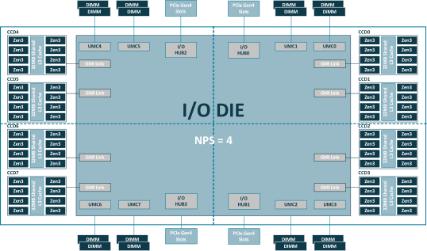

# Exercise: DAXPY on Cluster Node

**Note: For this exercise you will need an entire compute node exclusively.**

In this exercise we want to analyze the performance of a **"DAXPY"** kernel:

```julia
y[i] = a * x[i] + y[i]
```

Here, DAXPY stands for **D**ouble precision (i.e. `Float64`) **A** times **X** **P**lus **Y**.
where `a` is a scalar and `x` and `y` are vectors.

**Initial questions**
* How many floating point operations (FLOPs) happen per DAXPY iteration?
* How many bytes need to be transferred per iteration?
* Is the kernel memory bound (i.e. bounded by data access) or compute bound (i.e. bound by how fast the CPU can crunch numbers)?

<details>
    <summary>Answers</summary>    
    
  * 2 FLOPs, one multiply and one addition.
  * 24 bytes. We read 8 bytes of data twice (`x[i]` and `y[i]`) and write 8 bytes of data once (`y[i]`).
  * The kernel is strongly memory bound.
</details>
<br>

Because the kernel is all about data access, we can use it to
* try to estimate the **maximal memory bandwidth** of a system
* learn about the effect of **thread pinning** and **NUMA** (non-uniform memory access)

Before we start with the actual exercise tasks, let's give a little bit of background.

## Background: NUMA in a nutshell

**Remark:** We will consider a AMD CPU below. The cluster that we're using as part of the course might have a different CPU with a different number of NUMA domains!

This is the schematic topology of a (Zen3) AMD CPU (typically there are two of those in a cluster node):



**Image source:** AMD, [High Performance Computing (HPC) Tuning Guide for AMD EPYCTM 7003 Series Processors](https://www.amd.com/system/files/documents/high-performance-computing-tuning-guide-amd-epyc7003-series-processors.pdf)

A set of 16 CPU-cores ("Zen3" in the image) forms a **memory domain** (a quarter in the image, see the dashed lines) in the sense that they share **local memory** (see the "DIMM" bars in the image). The entire CPU has four memory domains (the four quarters in the image). Hence, a cluster node that hosts two of these CPUs has 8 memory domains in total.

The crucial point: **Accessing data in a memory domain that is far away from a CPU-core takes much longer than accessing data in the local memory domain.** (That's why it is called NUMA, i.e. non-uniform memory access.)

How can we control where our data (say parts of an array) is located? We can use the so-called **first touch policy**: the core that first writes to an element of the array determines where this element (more specifically the corresponding "memory page") will land, namely in the memory domain that is local to this core. Of course, to actually control this, we need to make sure that our Julia threads run on specific CPU-cores (which then determine the memory location). This thread-core affinity is what we can specify with ThreadPinning.jl.

## Exercise Tasks

1. Look at the given code file `daxpy_cpu.jl` and make yourself familiar with the function `measure_daxpy_perf` (understand what it does).

2. Implement the `axpy_kernel_dynamic!` and `axpy_kernel_static!` functions (look for the first two TODO annotations).

3. Implement the TODOs in the function `generate_input_data`. Depending on the value of the keyword argument `parallel`, this function will fill the input vectors for the (D)AXPY operation with random numbers either sequentially or in parallel. (**Note:** This might seem irrelevant but very much isn't be because of the **first-touch policy** mentioned above.)

4. Submit the given job script via `sbatch job_script.sh`. This will run the file `daxpy_cpu.jl` with multiple Julia threads. The job might take a few minutes to start/run.

5. While the job is running, make sure that you know the core features (number of cores/sockets/NUMA domains etc.) of the cluster compute nodes you're running on. (You could use `using SysInfo; sysinfo()`, for example.)

The job should produce an output file (has extension `.out`). It should show two tables like below, one for the `:static` and one for the `:dynamic` multithreading variant.

```
Memory Bandwidth (GB/s)
┌───────────────┬─────────┬───────────┐
│ # Threads = X │ :serial │ :parallel │
├───────────────┼─────────┼───────────┤
│        :cores │   00.00 │     00.00 │
│      :sockets │   00.00 │     00.00 │
│         :numa │   00.00 │     00.00 │
└───────────────┴─────────┴───────────┘
```

The columns (`:serial`, `:parallel`) indicate how the data was initialized. The rows (`:cores`, `:sockets`, `:numa`) indicate how the Julia threads have been pinned to CPU-cores (i.e. in a round-robin fashion to cores, sockets or memory domains, respectively).

5. Inspect the output file and focus on the `:static` case first. Can you make sense of the results? What do you learn from this?
    1. **Hint 1:** Why is the pinning irrelevant in the `:serial:` case?
    2. **Hint 2:** Take (approximate) ratios of the numbers (e.g. "`:parallel / :serial`" for different pinning strategies).
    3. **Hint 3:** How many sockets does a compute node have? How many memory domains are there in total?

6. Compare the results that you've obtained for `:static` and `:dynamic`. Can you explain (qualitatively) how the performance difference comes about?

7. **Bonus:** Let's perform a scaling analysis and, among others, run a performance measurement with one Julia thread per core. This will give us a (crude) empirical estimate for the maximal memory bandwidth of a compute node. We've already prepared the Julia script `daxpy_cpu_scaling.jl` for this, which produces tabular output as well as a scaling plot. Run the scaling analysis via `sbatch job_script_scaling.sh` and (after maybe ~15 minutes) inspect the results.